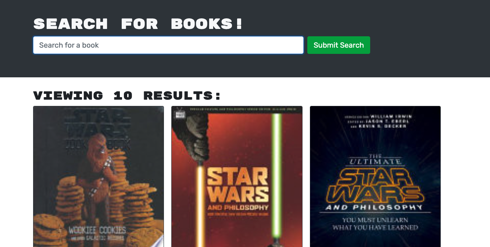

# Book Search Engine

## Link to Deployed Application
https://arcane-spire-81137.herokuapp.com/

## Table of Contents
* [Description](#description)
  * [Built With](#built-with)
* [Screenshot](#screenshot) 
* [Installation](#installation)
* [Usage](#usage)
* [License](#license)
* [Contact](#contact)

## Description 
Book Search Engine is an application that enables users to search for books. If the user is logged in, they can save books to their account. They can also view their saved books with the option to remove them.

### Built With
```
Apollo Client, Apollo Server (Express), Bootstrap, Express.js, GraphQL, jsonwebtoken, jwt-decode, MongoDB, Mongoose, Node.js, React
```

## Screenshot


## License
MIT License

## Contact Information
Rod Blanco
* Email: <rodrigo.a.blanco1990@gmail.com>